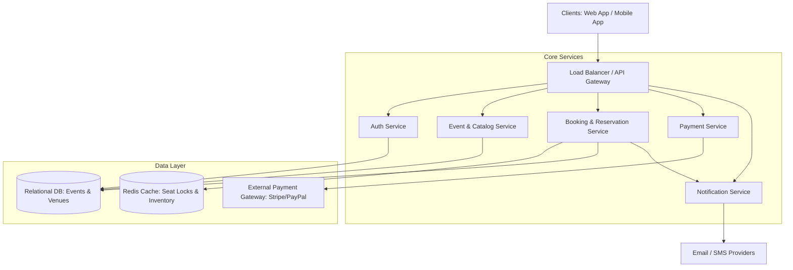

```mermaid
graph TD
    Client[Clients: Web App / Mobile App] --> LB[Load Balancer / API Gateway]

    subgraph Core_Services [Core Services]
        LB --> Auth[Auth Service]
        LB --> EventSvc[Event & Catalog Service]
        LB --> BookingSvc[Booking & Reservation Service]
        LB --> PaymentSvc[Payment Service]
        LB --> NotifSvc[Notification Service]
    end

    subgraph Data_Layer [Data Layer]
        EventSvc --> RDS[(Relational DB: Events & Venues)]
        BookingSvc --> Redis[(Redis Cache: Seat Locks & Inventory)]
        BookingSvc --> RDS
        Auth --> RDS
        PaymentSvc --> PaymentGW[External Payment Gateway: Stripe/PayPal]
    end

    BookingSvc --> NotifSvc
    NotifSvc --> EmailSMS[Email / SMS Providers]
```
