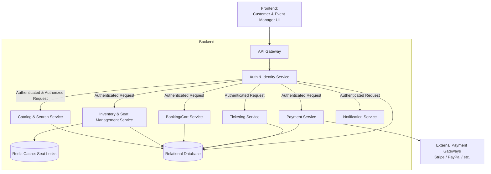

```mermaid
graph TD
    Client[Frontend:<br>Customer & Event Manager UI] --> APIGateway[API Gateway]
    
    AuthSvc -->|Authenticated & Authorized Request| EventMgmtSvc["Catalog & Search Service"]
    AuthSvc -->|Authenticated Request| InventorySvc["Inventory & Seat Management Service"]
    AuthSvc -->|Authenticated Request| BookingSvc[ Booking/Cart Service]
    AuthSvc -->|Authenticated Request| TicketSvc["Ticketing Service"]
    AuthSvc -->|Authenticated Request| PaymentSvc[Payment Service]
    
    PaymentSvc --> ExtGateway[External Payment Gateways<br/>Stripe / PayPal / etc.]
    
    subgraph Backend
    AuthSvc -->|Authenticated Request| NotifSvc[Notification Service]
        APIGateway --> AuthSvc[Auth & Identity Service<br/>]
        InventorySvc --> Redis[(Redis Cache: Seat Locks)]
        EventMgmtSvc --> DB[(Relational Database)]
        InventorySvc --> DB
        BookingSvc --> DB
        PaymentSvc --> DB
        TicketSvc --> DB
        AuthSvc --> DB
    end
```
