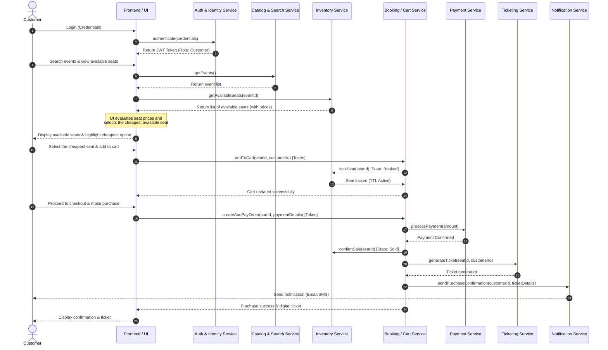

```mermaid
sequenceDiagram
    autonumber
    actor Customer
    participant UI as Frontend / UI
    participant Auth as Auth & Identity Service
    participant Search as Catalog & Search Service
    participant Inventory as Inventory Service
    participant Booking as Booking / Cart Service
    participant Payment as Payment Service
    participant Ticket as Ticketing Service
    participant Notif as Notification Service

    Customer->>UI: Login (Credentials)
    UI->>Auth: authenticate(credentials)
    Auth-->>UI: Return JWT Token (Role: Customer)

    Customer->>UI: Search events & view available seats
    UI->>Search: getEvents()
    Search-->>UI: Return event list
    UI->>Inventory: getAvailableSeats(eventId)
    Inventory-->>UI: Return list of available seats (with prices)
    
    Note over UI: UI evaluates seat prices and<br/>selects the cheapest available seat
    UI-->>Customer: Display available seats & highlight cheapest option

    Customer->>UI: Select the cheapest seat & add to cart
    UI->>Booking: addToCart(seatId, customerId) [Token]
    Booking->>Inventory: lockSeat(seatId) [State: Booked]
    Inventory-->>Booking: Seat locked (TTL Active)
    Booking-->>UI: Cart updated successfully

    Customer->>UI: Proceed to checkout & make purchase
    UI->>Booking: createAndPayOrder(cartId, paymentDetails) [Token]
    Booking->>Payment: processPayment(amount)
    Payment-->>Booking: Payment Confirmed

    Booking->>Inventory: confirmSale(seatId) [State: Sold]
    Booking->>Ticket: generateTicket(seatId, customerId)
    Ticket-->>Booking: Ticket generated
    Booking->>Notif: sendPurchaseConfirmation(customerId, ticketDetails)
    Notif-->>Customer: Send notification (Email/SMS)

    Booking-->>UI: Purchase success & digital ticket
    UI-->>Customer: Display confirmation & ticket
```