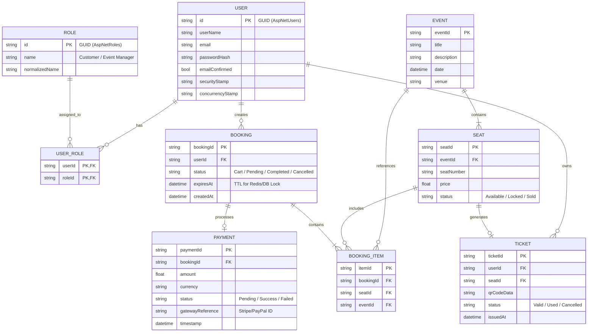

```mermaid

erDiagram
    USER ||--o{ USER_ROLE : has
    ROLE ||--o{ USER_ROLE : assigned_to
    
    USER ||--o{ BOOKING : creates
    USER ||--o{ TICKET : owns
    
    EVENT ||--|{ SEAT : contains
    EVENT ||--o{ BOOKING_ITEM : references
    
    SEAT ||--o{ BOOKING_ITEM : includes
    SEAT ||--o| TICKET : generates
    
    BOOKING ||--|{ BOOKING_ITEM : contains
    BOOKING ||--o| PAYMENT : processes
    
    USER {
        string id PK "GUID (AspNetUsers)"
        string userName
        string email
        string passwordHash
        bool emailConfirmed
        string securityStamp
        string concurrencyStamp
    }

    ROLE {
        string id PK "GUID (AspNetRoles)"
        string name "Customer / Event Manager"
        string normalizedName
    }

    USER_ROLE {
        string userId PK, FK
        string roleId PK, FK
    }

    EVENT {
        string eventId PK
        string title
        string description
        datetime date
        string venue
    }

    SEAT {
        string seatId PK
        string eventId FK
        string seatNumber
        float price
        string status "Available / Locked / Sold"
    }

    BOOKING {
        string bookingId PK
        string userId FK
        string status "Cart / Pending / Completed / Cancelled"
        datetime expiresAt "TTL for Redis/DB Lock"
        datetime createdAt
    }

    BOOKING_ITEM {
        string itemId PK
        string bookingId FK
        string seatId FK
        string eventId FK
    }

    PAYMENT {
        string paymentId PK
        string bookingId FK
        float amount
        string currency
        string status "Pending / Success / Failed"
        string gatewayReference "Stripe/PayPal ID"
        datetime timestamp
    }

    TICKET {
        string ticketId PK
        string userId FK
        string seatId FK
        string qrCodeData
        string status "Valid / Used / Cancelled"
        datetime issuedAt
    }
```