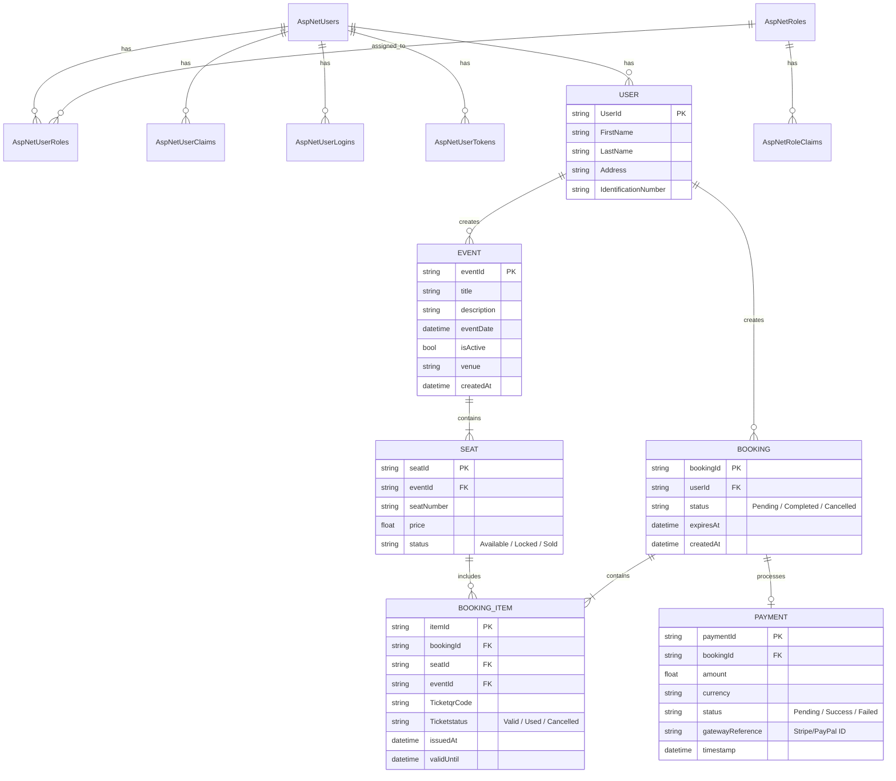

```mermaid
erDiagram
    AspNetUsers ||--o{ AspNetUserRoles : has
    AspNetRoles ||--o{ AspNetUserRoles : assigned_to
    
    AspNetUsers ||--o{ AspNetUserClaims : has
    AspNetUsers ||--o{ AspNetUserLogins : has
    AspNetUsers ||--o{ AspNetUserTokens : has
    AspNetUsers ||--o{ USER : has
    
    AspNetRoles ||--o{ AspNetRoleClaims : has

    USER ||--o{ EVENT : creates
    USER ||--o{ BOOKING : creates

    
    
    EVENT ||--|{ SEAT : contains
    
    
    SEAT ||--o{ BOOKING_ITEM : includes
    
    
    BOOKING ||--|{ BOOKING_ITEM : contains
    BOOKING ||--o| PAYMENT : processes
    
    USER {

        string UserId PK
        string FirstName
        string LastName
        string Address
        string IdentificationNumber
    }

    EVENT {
        string eventId PK
        string title
        string description
        datetime eventDate
        bool isActive
        string venue
        datetime createdAt
    }

    SEAT {
        string seatId PK
        string eventId FK
        string seatNumber
        float price
        string status "Available / Locked / Sold"
    }

    BOOKING {
        string bookingId PK
        string userId FK
        string status " Pending / Completed / Cancelled"
        datetime expiresAt 
        datetime createdAt
    }

    BOOKING_ITEM {
        string itemId PK
        string bookingId FK
        string seatId FK
        string eventId FK
        string TicketqrCode
        string Ticketstatus "Valid / Used / Cancelled"
        datetime issuedAt
        datetime validUntil
    }

    PAYMENT {
        string paymentId PK
        string bookingId FK
        float amount
        string currency
        string status "Pending / Success / Failed"
        string gatewayReference "Stripe/PayPal ID"
        datetime timestamp
    }

```