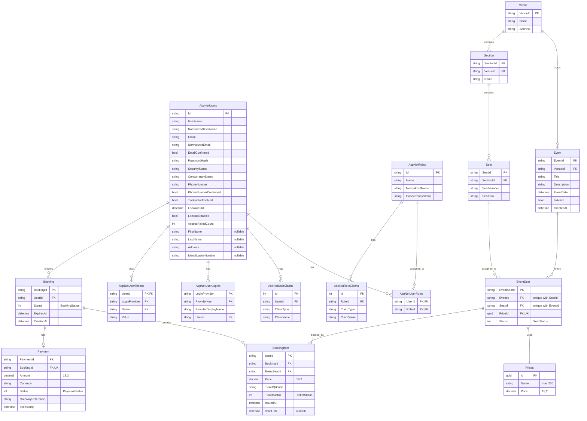

```mermaid
erDiagram
    AspNetUsers ||--o{ AspNetUserRoles : has
    AspNetRoles ||--o{ AspNetUserRoles : assigned_to
    AspNetUsers ||--o{ AspNetUserClaims : has
    AspNetUsers ||--o{ AspNetUserLogins : has
    AspNetUsers ||--o{ AspNetUserTokens : has
    AspNetRoles ||--o{ AspNetRoleClaims : has

    AspNetUsers ||--o{ Booking : creates
    Venue ||--o{ Event : hosts
    Venue ||--o{ Section : contains
    Section ||--o{ Seat : contains
    Event ||--o{ EventSeat : offers
    Seat ||--o{ EventSeat : assigned_to
    EventSeat ||--|| Prices : uses
    Booking ||--o{ BookingItem : contains
    EventSeat ||--o{ BookingItem : booked_as
    Booking ||--o| Payment : has

    AspNetUsers {
        string Id PK
        string UserName
        string NormalizedUserName
        string Email
        string NormalizedEmail
        bool EmailConfirmed
        string PasswordHash
        string SecurityStamp
        string ConcurrencyStamp
        string PhoneNumber
        bool PhoneNumberConfirmed
        bool TwoFactorEnabled
        datetime LockoutEnd
        bool LockoutEnabled
        int AccessFailedCount
        string FirstName "nullable"
        string LastName "nullable"
        string Address "nullable"
        string IdentificationNumber "nullable"
    }

    AspNetRoles {
        string Id PK
        string Name
        string NormalizedName
        string ConcurrencyStamp
    }

    AspNetUserRoles {
        string UserId PK, FK
        string RoleId PK, FK
    }

    AspNetUserClaims {
        int Id PK
        string UserId FK
        string ClaimType
        string ClaimValue
    }

    AspNetUserLogins {
        string LoginProvider PK
        string ProviderKey PK
        string ProviderDisplayName
        string UserId FK
    }

    AspNetUserTokens {
        string UserId PK, FK
        string LoginProvider PK
        string Name PK
        string Value
    }

    AspNetRoleClaims {
        int Id PK
        string RoleId FK
        string ClaimType
        string ClaimValue
    }

    Event {
        string EventId PK
        string VenueId FK
        string Title
        string Description
        datetime EventDate
        bool IsActive
        datetime CreatedAt
    }

    Venue {
        string VenueId PK
        string Name
        string Address
    }

    Section {
        string SectionId PK
        string VenueId FK
        string Name
    }

    Seat {
        string SeatId PK
        string SectionId FK
        string SeatNumber
        string SeatRow
    }

    EventSeat {
        string EventSeatId PK
        string EventId FK "unique with SeatId"
        string SeatId FK "unique with EventId"
        guid PriceId FK, UK
        int Status "SeatStatus"
    }

    Prices {
        guid Id PK
        string Name "max 200"
        decimal Price "18,2"
    }

    Booking {
        string BookingId PK
        string UserId FK
        int Status "BookingStatus"
        datetime ExpiresAt
        datetime CreatedAt
    }

    BookingItem {
        string ItemId PK
        string BookingId FK
        string EventSeatId FK
        decimal Price "18,2"
        string TicketQrCode
        int TicketStatus "TicketStatus"
        datetime IssuedAt
        datetime ValidUntil "nullable"
    }

    Payment {
        string PaymentId PK
        string BookingId FK, UK
        decimal Amount "18,2"
        string Currency
        int Status "PaymentStatus"
        string GatewayReference
        datetime Timestamp
    }
```
